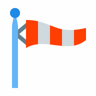

<div id="top"></div>


<!-- PROJECT LOGO -->
<br />
<div align="center">
    

  <h3 align="center">Weather App</h3>

  <p align="center">Get weather from French cities</p>
</div>

 <br />  

<!-- TABLE OF CONTENTS -->
<details>
  <summary>Table of Contents</summary>
  <ol>
    <li>
      <a href="#about-the-project">🧭 About The Project</a>
      <ul>
        <li><a href="#built-with">🏗️ Built With</a></li>
      </ul>
    </li>
    <li>
      <a href="#getting-started">📋 Getting Started</a>
      <ul>
        <li><a href="#prerequisites">🗺️ Prerequisites</a></li>
        <li><a href="#installation">⚙️ Installation</a></li>
      </ul>
    </li>
    <li><a href="#usage">💾 Usage</a></li>
    <li><a href="#contributing">🔗 Contributing</a></li>
    <li><a href="#license">📰 License</a></li>
    <li><a href="#contact">📫 Contact</a></li>
    <li><a href="#acknowledgments">⛱️ Acknowledgments</a></li>
  </ol>
</details>

<br>


<!-- ABOUT THE PROJECT -->
## 🧭 About The Project

### 🏗️ Built With

List of technologies / frameworks used during the project.

* [](https://developer.mozilla.org/en/docs/Web/JavaScript)
* [](https://developer.mozilla.org/en/docs/Web/HTML)
* [](https://developer.mozilla.org/en/docs/Web/CSS)

<p align="right"><a href="#top">⬆️</a></p>


<!-- GETTING STARTED -->
## 📋 Getting Started

To get a local copy up and running follow these simple example steps.

### 🗺️ Prerequisites

* Get Api key from http://api.weatherstack.com/

<p align="right"><a href="#top">⬆️</a></p>


<!-- USAGE EXAMPLES -->
## 💾 Usage

```
open / run index.html
```

<p align="right"><a href="#top">⬆️</a></p>


<!-- CONTRIBUTING -->
## 🔗 Contributing

Contributions are what make the open source community such an amazing place to learn, inspire, and create. Any contributions you make are **greatly appreciated**.

If you have a suggestion that would make this better, please fork the repo and create a pull request. You can also simply open an issue with the tag "enhancement".
Don't forget to give the project a star! Thanks again!

1. Fork the Project
2. Create your Feature Branch (`git checkout -b feature/AmazingFeature`)
3. Commit your Changes (`git commit -m 'Add some AmazingFeature'`)
4. Push to the Branch (`git push origin feature/AmazingFeature`)
5. Open a Pull Request

<p align="right"><a href="#top">⬆️</a></p>


<!-- LICENSE -->
## 📰 License

Distributed under the MIT License. See `LICENSE.txt` for more information.

<p align="right"><a href="#top">⬆️</a></p>


<!-- CONTACT -->
## 📫 Contact

Reach me at : gauron.dorian.pro@gmail.com.

Project Link: [https://github.com/Michelprogram/weather](https://github.com/Michelprogram/weather)

<p align="right"><a href="#top">⬆️</a></p>


<!-- ACKNOWLEDGMENTS -->
## ⛱️ Acknowledgments

This space is a list to resources i found helpful and would like to give credit to.

* [Play with api](https://developer.mozilla.org/fr/docs/Web/API/XMLHttpRequest)

<p align="right"><a href="#top">⬆️</a></p>

<a href="https://github.com/othneildrew/Best-README-Template">Template inspired by othneildrew</a>